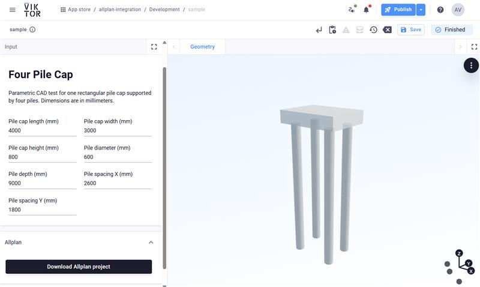
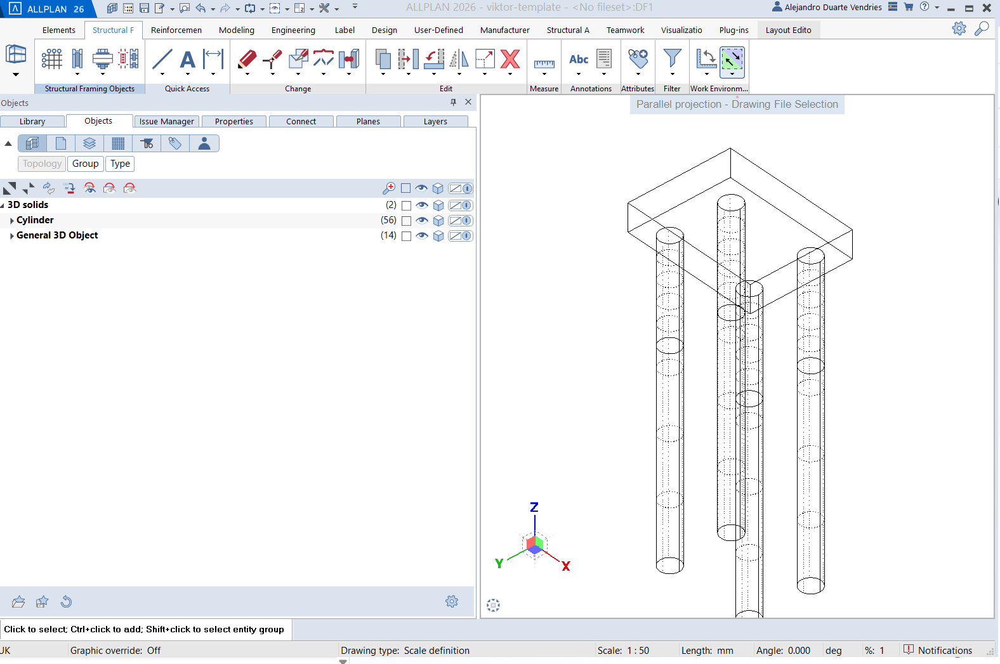

VIKTOR demo app for a simple pile cap reinforcement workflow in Allplan.

The app keeps the flow intentionally small:

- Parametrize a rectangular pile cap on four piles.
- Configure concrete cover, mat bars, cap links, pile verticals, and pile hoops.
- Review a clean 2D rebar sketch in a WebView.
- Review a calculated bar schedule in a TableView.
- Send the same parameters to an Allplan PythonPart worker.

