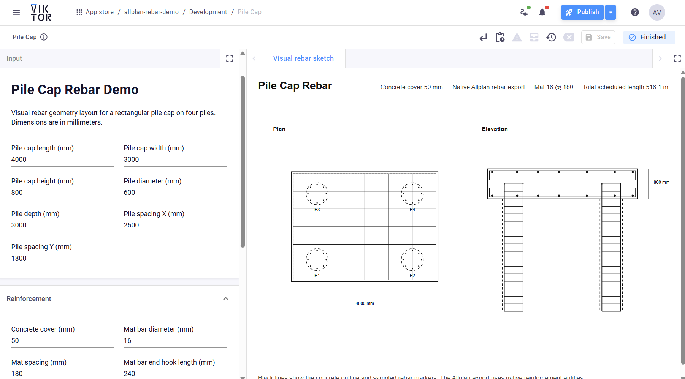
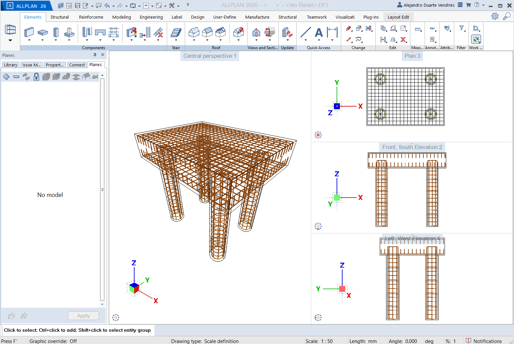

VIKTOR demo app for a simple pile cap rebar workflow in Allplan.

The app keeps the flow small and easy to follow:

- Parametrize a rectangular pile cap on four piles.
- Configure concrete cover, cap mat bars, pile vertical bars, and pile hoops in VIKTOR.
- Review a clean 2D sketch and a simple quantity table.
- Send the same parameters to an Allplan PythonPart worker.
- Download an Allplan project with the pile cap, piles, and native Allplan reinforcement.

The Allplan worker creates real reinforcement entities for the cap mats, pile vertical bars, and pile hoops. Mat bars and pile vertical bars can include 90-degree hooks from the VIKTOR inputs.

The worker uses a clean project ZIP template for each run. It extracts the template to a job-local `result_project.prj`, opens it with Allplan's `/l ...\Project1.Dat.xml` startup argument, runs the PythonPart with `-o`, and returns the modified project as `result_project.zip`.

