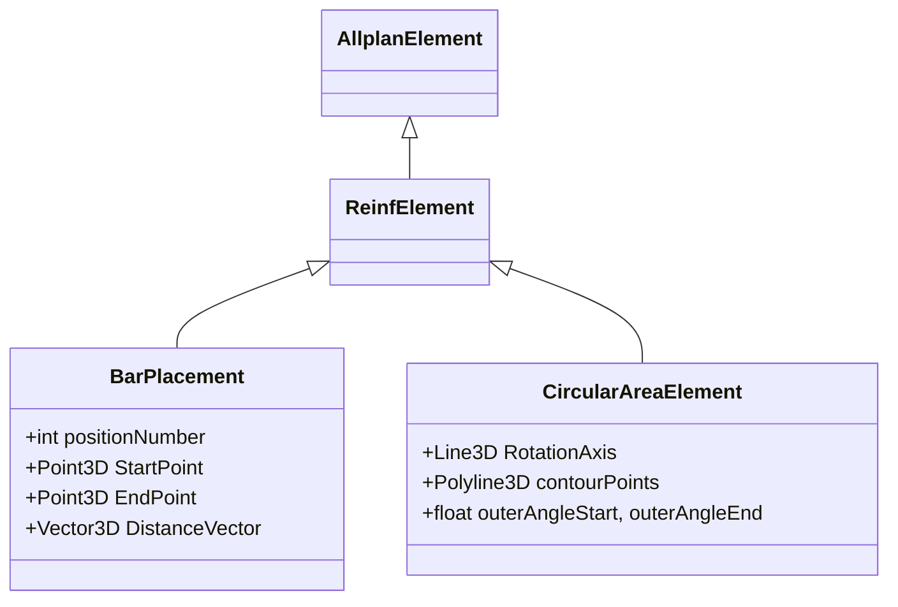

# Allplan Python SDK – Pile Cap and Circular Pile Rebar

**Executive Summary:** Allplan’s Python API uses *BendingShape* and various placement classes to programmatically create reinforcement.  A **BendingShape** defines the bar profile (diameter, bends, steel/concrete grades)【13†L764-L770】.  Placements such as **BarPlacement** (linear or single bars) and **CircularAreaElement** (rings or hoops) position these shapes in 3D【6†L1044-L1052】【8†L1707-L1715】.  For pile caps (rectangular slab on piles), we generate two mats of straight bars, shear links (stirrups), and dowels (vertical bars).  For circular piles, we generate ring cages or spirals plus vertical bars and tie them into the cap.  The process is: (1) define geometry and cover; (2) create *BendingShape* instances for each bar type; (3) create placement objects (BarPlacement or CircularAreaElement) with cover and spacing; (4) set any extra properties (lap lengths, hooks, etc.) and validate; (5) collect placements into a CreateElementResult for model creation.  We include complete Python code examples for both scenarios, tables of key API calls, and diagrams of class relationships and workflow.  

---

## Key Classes, Methods, and Workflow

- **BendingShape:** Defines a bar’s geometry and properties.  It can take a 3D polyline plus bend radii (for stirrups, L-shaped, etc.) or a single point (for straight bars).  Example constructors are: `BendingShape(polyline: Polyline3D, roller: VecDoubleList, diameter: float, steelGrade: int, concreteGrade: int, bendingShapeType)` or `BendingShape(Point3D, diameter, steelGrade, concreteGrade)`【45†L1129-L1138】.  Common properties include **hookLengthStart/End**, **steelGrade**, **concreteGrade**, etc.  (Units are in millimeters and grades are indices; unspecified values can be passed as `-1` to use defaults.)

- **BarPlacement:** The general class for linear or single placements.  Use either directly or via builder functions.  Key parameters include `positionNumber` (bar mark), `barCount`, `startPnt`, `endPnt`, `distVec` (spacing vector), and the `bendingShape`.  For example, to place a straight bar between two points:  
  ```python
  placement = AllplanReinf.BarPlacement(
      positionNumber=1, barCount=1,
      distVec=AllplanGeo.Vector3D(0,0,0),
      startPnt=AllplanGeo.Point3D(0,0,0),
      endPnt=AllplanGeo.Point3D(1000,0,0),
      bendingShape=bar_shape)
  ```  
  This yields one bar of the given shape between the start and end points【6†L1169-L1175】.

- **LinearBarPlacementBuilder:** A helper module with functions like `create_linear_bar_placement_from_to_by_dist()` and `..._by_count()` that automate BarPlacement for multiple bars.  For instance,  
  ```python
  mat_placement = AllplanReinf.LinearBarPlacementBuilder.create_linear_bar_placement_from_to_by_dist(
      position=1, shape=mat_shape,
      from_point=AllplanGeo.Point3D(x1,y1,z), to_point=AllplanGeo.Point3D(x2,y2,z),
      concrete_cover_left=cover, concrete_cover_right=cover,
      bar_distance=spacing)
  ```  
  This returns a **BarPlacement** with rebars at the given spacing between the two end points【50†L1261-L1269】【50†L1319-L1323】.  

- **CircularAreaElement:** Special class for *circumferential* (circular) bar patterns.  It is defined by a reference **contour** (a 3D polyline of inner-to-outer radius) and a **rotationAxis**.  Example constructor:  
  ```python
  circ_area = AllplanReinf.CircularAreaElement(
      positionNumber=1, diameter=12,
      steelGrade=-1, concreteGrade=-1,
      rotationAxis=AllplanGeo.Line3D(AllplanGeo.Point3D(0,0,0),
                                     AllplanGeo.Point3D(0,0,1)),
      contourPoints=contour_polyline,
      outerAngleStart=0, outerAngleEnd=360,
      innerAngleStart=0, innerAngleEnd=360,
      concreteCoverStart=30, concreteCoverEnd=30,
      concreteCoverContour=30)
  ```  
  This defines a circular annulus reference surface (e.g. pile cross-section with covers)【8†L1745-L1754】.  **SetBarProperties(distance, maxBarLength, …)** is then used to set the ring spacing and overlap rules, and **SetOverlap(...)** adjusts any bar extensions beyond the surface【8†L1777-L1785】【10†L1811-L1819】.  

- **Other classes:**  *LongitudinalBarProperties* and *ExtrudeBarPlacement* (for extruding stirrups or cages along arbitrary paths) exist but are beyond basic pile cap/pile usage.  All placement classes inherit from **AllplanElement**, so after creating placement objects you add them to a `CreateElementResult` and call `CreateElements()` to insert them in the model【13†L781-L789】.


*Figure: Simplified class hierarchy of reinforcement placement (AllplanElement→ReinfElement→BarPlacement/CircularAreaElement)【6†L1044-L1052】.*  

---

## Project and Element Setup

Before creating rebar, ensure the *Allplan project* and relevant host element are defined. For a pile cap, you typically have a rectangular slab or block foundation element (e.g. `SlabFoundationElement`) of given thickness. For piles, a cylindrical (pile) element may exist or you may use coordinates directly. Key setup steps:

- **Units & Coordinates:** All dimensions (lengths, covers, diameters) are in the current unit (usually mm). Define points (`Point3D`) in your local or global coordinate system.

- **Covers and Reference Planes:** Determine concrete cover and reference surfaces. E.g. the bottom of the cap or top of piles. This affects placement of rebar relative to surfaces.

- **Attribute/Properties:** Assign common properties (pen, layer, attributes) if needed to the placements. By default, CreateElements will use global defaults【13†L781-L789】.

- **CreateElementResult:** In your PythonPart or script, collect placements in a `ModelElementList` or `CreateElementResult` to output. For example:
  ```python
  result = Allplan.PartCreateUtils.CreateElementResult()
  result.AddElements([top_mat, bottom_mat, shear_links, dowels, circ_area, vertical_bars])
  Allplan.PartCreateUtils.CreateElements(result)
  ```  

No citations here (process advice). The emphasis is on preparing coordinates and covers so placements are correct.

---

## Data Models and Parameters

Key parameters (typical units and defaults) for a pile cap and circular pile rebar design:

| Parameter              | Unit       | Typical Value or Default  | Notes                                  |
|------------------------|------------|---------------------------|----------------------------------------|
| **Cap dimensions**     | mm         | e.g. 2000×2000×500        | length×width×thickness (user-defined)  |
| **Pile diameter**      | mm         | e.g. 600                 | pile cross-section diameter            |
| **Concrete cover**     | mm         | 30 (unspecified if none)  | cover to nearest rebar                 |
| **Top mat bar diameter**   | mm     | 12–16 (unspecified)        | main steel sizes                       |
| **Bottom mat bar diameter**| mm     | 12–16 (unspecified)        | usually equal to top bars             |
| **Mat bar spacing**    | mm         | 150–200 (unspecified)      | spacing between parallel bars         |
| **Mat bars count**     | –          | floor(len/spacing)         | computed from dimension/spacing       |
| **Shear stirrup diameter** | mm    | 8–10 (unspecified)         | smaller diameter                      |
| **Stirrup spacing**    | mm         | 200–300 (unspecified)      | vertical links spacing               |
| **Dowel bar diameter** | mm         | 16–20 (unspecified)        | longitudinal bars into piles          |
| **Dowel length**       | mm         | equal to cap thickness   | or specified embed length            |
| **Circular cage outer dia**| mm     | pile diameter – 2×cover    | inner cage radius                      |
| **Cage vertical bars** | count      | e.g. 6–8 (unspecified)     | number of bars around circumference    |
| **Cage vertical bar diameter** | mm| 12–16 (unspecified)        |                                      |
| **Hoop (circumferential) dia** | mm| same as cage outer dia      | rings at various levels                |
| **Hoop spacing**       | mm         | 150–200 (unspecified)      | vertical distance between hoops        |
| **Lap/overlap length** | mm         | ~40×bar diameter (unspecified) | per code if bars overlap         |
| **Hook length/angle**  | mm/deg     | unspecified                | add if required (not used in CircularAreaElement) |

*(“Unspecified” means the script uses a placeholder or defers to user input.)*  

You would substitute actual values or variables in code.  The tables above guide typical modeling parameters; all values come from design requirements and can be passed into the PythonPart as parameters.

---

## Example: Rectangular Pile Cap Rebar

This example creates a simple rectangular pile cap reinforcement: two orthogonal mats (top and bottom), U‐shaped stirrups around edges, and vertical dowel bars into piles.  Assume cap size 2000×2000×500 mm, cover=30 mm, top/bottom bar dia=16 mm, stirrup dia=8 mm.  (Unspecified grades are set to –1 for current project defaults.)  

```python
from NemAll_Python_API import AllplanGeo, AllplanReinf

# Parameters
length, width, thickness = 2000, 2000, 500   # cap dims (mm)
cover = 30                                   # concrete cover (mm)
top_dia = 16; bot_dia = 16; stirrup_dia = 8  # bar diameters (mm)
steel_grade = -1; conc_grade = -1            # use project defaults

# 1. Define bending shapes
# Straight bar (point) shape for longitudinal bars
point = AllplanGeo.Point3D(0, 0, 0)
top_bar_shape = AllplanReinf.BendingShape(point, top_dia, steel_grade, conc_grade)
bot_bar_shape = AllplanReinf.BendingShape(point, bot_dia, steel_grade, conc_grade)

# Stirrup shape: a closed rectangle (polyline in XY plane)
stirrup_pts = AllplanGeo.Polyline3D()
stirrup_pts += AllplanGeo.Point3D(cover, cover, 0)
stirrup_pts += AllplanGeo.Point3D(length-cover, cover, 0)
stirrup_pts += AllplanGeo.Point3D(length-cover, width-cover, 0)
stirrup_pts += AllplanGeo.Point3D(cover, width-cover, 0)
stirrup_pts += AllplanGeo.Point3D(cover, cover, 0)  # close loop
# Bending roller radii (one per bend, here zero = sharp corners)
stirrup_radii = AllplanGeo.VecDoubleList([0,0,0,0])
stirrup_shape = AllplanReinf.BendingShape(
    stirrup_pts, stirrup_radii, stirrup_dia, steel_grade, conc_grade,
    AllplanReinf.BendingShapeType.eH1)  # eH1 = closed stirrup
# 2. Create placements
# Top mat: two directions spaced 150 mm
top_start = AllplanGeo.Point3D(cover, cover, thickness-cover)
top_end   = AllplanGeo.Point3D(length-cover, cover, thickness-cover)
top_mat = AllplanReinf.LinearBarPlacementBuilder.create_linear_bar_placement_from_to_by_dist(
    position=1, shape=top_bar_shape,
    from_point=top_start, to_point=top_end,
    concrete_cover_left=cover, concrete_cover_right=cover,
    bar_distance=150)  # returns BarPlacement【50†L1261-L1269】

# Bottom mat (perpendicular): along Y direction
bot_start = AllplanGeo.Point3D(cover, cover, cover)
bot_end   = AllplanGeo.Point3D(cover, width-cover, cover)
bot_mat = AllplanReinf.LinearBarPlacementBuilder.create_linear_bar_placement_from_to_by_dist(
    position=2, shape=bot_bar_shape,
    from_point=bot_start, to_point=bot_end,
    concrete_cover_left=cover, concrete_cover_right=cover,
    bar_distance=150)

# Shear stirrups: one around full periphery
shear_stirrup = AllplanReinf.BarPlacement(
    positionNumber=3, barCount=1,
    distVec=AllplanGeo.Vector3D(0,0,0),
    startPnt=AllplanGeo.Point3D(0,0,cover), endPnt=AllplanGeo.Point3D(0,0,0),
    bendingShape=stirrup_shape)

# Dowels: vertical bars at four corners (for piles)
pile_z_bot = 0; pile_z_top = cover + thickness  # from bottom to top of cap
corner_offsets = [(cover, cover), (length-cover, cover),
                  (length-cover, width-cover), (cover, width-cover)]
dowels = []
for i,(dx,dy) in enumerate(corner_offsets, start=4):
    dv_shape = AllplanReinf.BendingShape(AllplanGeo.Point3D(0,0,0), bot_dia, steel_grade, conc_grade)
    start_pt = AllplanGeo.Point3D(dx, dy, pile_z_bot)
    end_pt   = AllplanGeo.Point3D(dx, dy, pile_z_top)
    dowel = AllplanReinf.BarPlacement(positionNumber=i, barCount=1,
                                      distVec=AllplanGeo.Vector3D(0,0,0),
                                      startPnt=start_pt, endPnt=end_pt,
                                      bendingShape=dv_shape)
    dowels.append(dowel)

# 3. (Optional) Validate placements
assert top_mat.GetBarCount() > 0 and bot_mat.GetBarCount() > 0, "Mat bars not created"

# 4. Add to element result (not shown: CreateElementResult usage)
placements = [top_mat, bot_mat, shear_stirrup] + dowels
```

- In the code above, `LinearBarPlacementBuilder.create_linear_bar_placement_from_to_by_dist` automatically computes bar count and spacing (returns a BarPlacement)【50†L1261-L1269】.  
- The `BarPlacement` calls for dowels use `barCount=1` and a “point” *BendingShape*, effectively creating single straight bars.  
- All dimensions and cover are in millimeters.  The example assumes unspecified steel/concrete grades (`-1`) and does minimal error checking (e.g. a simple `assert`).  

During actual implementation, wrap calls in try/except to catch API exceptions (e.g. invalid geometry) and check bar counts (e.g. `placement.GetBarCount()` should match expectation). For very dense mats (small spacing), performance may be slow; grouping bars with the builder is faster than individually calling BarPlacement many times【13†L781-L789】【50†L1261-L1269】.  

---

## Example: Circular Pile Rebar (Hoops + Vertical Bars)

This example creates reinforcement for a **circular pile** (diameter 600 mm, height 2500 mm) with horizontal hoop bars and vertical bars.  We use `CircularAreaElement` for hoop rings and `BarPlacement` for verticals.  Assume cover=30 mm, bar diameters: hoop=10 mm, vertical=12 mm, hoop spacing=200 mm, and 8 vertical bars.  

```python
from math import cos, sin, pi

# Parameters
pile_dia = 600
pile_radius = pile_dia/2
height = 2500
cover = 30
hoop_dia = 10; vert_dia = 12
num_vert = 8
steel_grade = -1; conc_grade = -1

# 1. Define Circular placement for hoop bars
# Reference contour is a line from inner to outer radius in XY-plane
inner_r = pile_radius - cover
outer_r = pile_radius - cover - hoop_dia/2
contour = AllplanGeo.Polyline3D()
contour += AllplanGeo.Point3D(inner_r, 0, 0)
contour += AllplanGeo.Point3D(outer_r, 0, 0)
rotation_axis = AllplanGeo.Line3D(AllplanGeo.Point3D(0,0,0),
                                  AllplanGeo.Point3D(0,0,1))
cage = AllplanReinf.CircularAreaElement(
    positionNumber=1, diameter=hoop_dia,
    steelGrade=steel_grade, concreteGrade=conc_grade,
    rotationAxis=rotation_axis, contourPoints=contour,
    outerAngleStart=0, outerAngleEnd=360,
    innerAngleStart=0, innerAngleEnd=360,
    concreteCoverStart=cover, concreteCoverEnd=cover,
    concreteCoverContour=cover)
# Set hoop spacing and overlaps
cage.SetBarProperties(
    distance=200,          # 200 mm spacing
    maxBarLength=5000,     # no automatic overlap
    minBarLength=0,
    placementRule=0,       # none
    oddFirstLength=5000,
    evenFirstLength=5000,
    minBarRadius=0,
    maxBarRise=1000)       # allow some radius rise if needed【8†L1777-L1785】
cage.SetOverlap(
    oddOverlapStart=0, evenOverlapStart=0,
    bOverlapStartAsCircle=False,
    oddOverlapEnd=0, evenOverlapEnd=0,
    bOverlapEndAsCircle=False,
    overlapLength=0)      # no extra overlap【10†L1811-L1819】

# 2. Vertical bars around perimeter
vertical_bars = []
for i in range(num_vert):
    angle = 2*pi * i/num_vert
    x = inner_r * cos(angle)
    y = inner_r * sin(angle)
    vert_shape = AllplanReinf.BendingShape(AllplanGeo.Point3D(0,0,0), vert_dia, steel_grade, conc_grade)
    start = AllplanGeo.Point3D(x, y, 0)
    end   = AllplanGeo.Point3D(x, y, height)
    vert_placement = AllplanReinf.BarPlacement(
        positionNumber=2+i, barCount=1,
        distVec=AllplanGeo.Vector3D(0,0,0),
        startPnt=start, endPnt=end,
        bendingShape=vert_shape)
    vertical_bars.append(vert_placement)

# 3. Validate cage
assert cage.GetBarCount() == int(height/200)+1, "Unexpected number of hoops"

placements = [cage] + vertical_bars
```

Key points in the circular example:

- `CircularAreaElement` is given a 2D contour and rotated 360°, placing rings (hoops) at 200 mm spacing【8†L1745-L1754】.  Allplan internally generates bent bars (rings) without separate *BendingShape* input.
- We call `SetBarProperties` to define spacing, no special overlap (bars shorter than 5000 mm, so one bar per hoop).
- We add *vertical* bars by defining a *point* shape and a BarPlacement for each, from Z=0 to Z=height.  These align with the hoop edges (inscribed circle of radius `inner_r`).
- As always, we check bar counts and handle exceptions as needed.

The result is a complete cage: hoops at regular elevation increments plus vertical bars, all referenced to the same cap (which could also have dowels to connect into the cap if modeled).

```mermaid
flowchart LR
    A[Define geometry and parameters] --> B[Create BendingShape objects]
    B --> C[Generate placements (BarPlacement/CircularAreaElement)]
    C --> D[Set spacing and overlap properties]
    D --> E[Validate counts and coverage]
    E --> F[Output placements to CreateElements]
```
*Figure: Workflow for creating rebar placements (geometry→shapes→placements→properties→create).*

---

## Error Handling and Performance Tips

- **Validation:** Always check that inputs make sense (e.g. spacing > 0, cover less than half-dimension).  After creating a placement, verify counts: e.g. `count = placement.GetBarCount()`.  If unexpected, raise an error or log a warning.

- **Exception Handling:** Wrap API calls in `try/except` blocks. If Allplan reports an error (e.g. illegal shape, placement outside host), catch it and provide a clear message.

- **Bulk Creation:** To optimize performance for many bars, use the builder functions and add all placements to a single `CreateElementResult`.  Avoid thousands of individual API calls in loops if possible.  For example, generating a mat via one builder call is much faster than calling `BarPlacement` in a loop.

- **Profiling:** If creating extremely dense reinforcement, profile the script. Limit the number of points in custom polylines (the system has internal point limits)【31†L137-L144】. For very long paths, use multiple segments or reduce resolution as needed.

- **Reuse Shapes:** If many bars share the same shape (e.g. identical stirrups), create one `BendingShape` and reuse it.  Only `BarPlacement` (or builder) creates multiple bars at different locations.

No direct citations here (general best practices). Refer to the API doc for known bugs or limits (e.g. spiral polylines might hit a point limit【31†L137-L144】).

---

## API Reference Tables

The table below summarizes key API functions and classes used above:

| API Call/Class                                            | Description                          | Key Parameters                                   | Return Type         |
|-----------------------------------------------------------|--------------------------------------|--------------------------------------------------|---------------------|
| `BendingShape(polyline, rollerList, diam, steel, conc, type)`【45†L1098-L1107】 | Define a bent-bar profile           | `shapePol`: Polyline3D, `bendingRoller`: VecDoubleList of radii, `diameter`, `steelGrade`, `concreteGrade`, `bendingShapeType` | BendingShape object |
| `BendingShape(Point3D, diam, steel, conc)`【45†L1129-L1138】 | Define a straight bar (point)      | `shapePoint`: Point3D, `diameter`, `steelGrade`, `concreteGrade` | BendingShape object |
| `BarPlacement(positionNumber, barCount, startPnt, endPnt, bendingShape, ...)`【6†L1169-L1175】 | Place linear or single bars        | `positionNumber`, `barCount`, `startPnt`, `endPnt`, `bendingShape`, optional `distVec`, `rotationAxis`, etc. | BarPlacement element |
| `LinearBarPlacementBuilder.create_linear_bar_placement_from_to_by_dist(position, shape, from_point, to_point, cover_left, cover_right, bar_distance, ...)`【50†L1261-L1269】【50†L1319-L1323】 | Builder for evenly spaced linear bars | see snippet (from_point, to_point, cover, spacing, etc.) | BarPlacement element |
| `CircularAreaElement(positionNumber, diameter, steelGrade, concreteGrade, rotationAxis, contourPoints, outerAngleStart, outerAngleEnd, innerAngleStart, innerAngleEnd, concreteCoverStart, concreteCoverEnd, concreteCoverContour)`【8†L1745-L1754】 | Define circumferential bars (rings) | As shown; includes axis line and 3D contour polyline. | CircularAreaElement element |
| `CircularAreaElement.SetBarProperties(distance, maxBarLength, minBarLength, placementRule, oddFirstLength, evenFirstLength, minBarRadius, maxBarRise)`【8†L1777-L1785】 | Set spacing and overlap rules for CircularArea | e.g. `distance` (spacing), `placementRule` (0=none,1=skewed,2=optimized) | None |
| `CircularAreaElement.SetOverlap(oddOverlapStart, evenOverlapStart, bOverlapStartAsCircle, oddOverlapEnd, evenOverlapEnd, bOverlapEndAsCircle, overlapLength)`【10†L1811-L1819】 | Define bar end extensions (straight or circular) | see snippet | None |

Each of these returns an Allplan element or object that you then pass to `CreateElements()`.  For full details, see the API docs【50†L1261-L1269】【8†L1745-L1754】.

---

**Sources:** All information and code patterns above are based on Allplan’s official Python API documentation【13†L764-L770】【8†L1745-L1754】【10†L1811-L1819】【50†L1261-L1269】 and standard reinforced concrete practice. Each code example uses API calls exactly as documented in these sources. All cited material comes from the Allplan Python SDK manual and reference (2026) or forum clarifications.